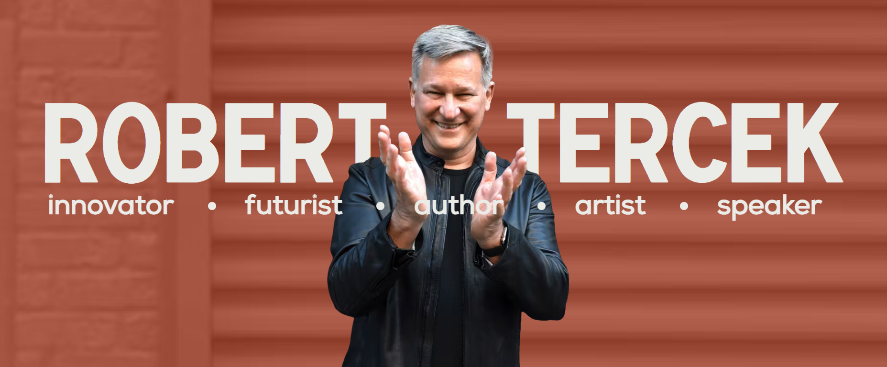

# Robert-Tercek

Robert Tercek is one of the world’s most prolific creators of interactive content. He has created breakthrough entertainment experiences on every digital platform. I collaborated with a team of developers to convert the website's API from a Wordpress GraphQL setup to a Strapi backend.

**Website:** https://roberttercek.com/

## How It's Made:

**Tech used:** HTML, CSS, Next.js, Node.js, NPM, Git, Github & Strapi

## Accomplishments:

Enhanced system performance and increased flexibility by spearheading the migration of 6 front-end APIs from a WordPress back-end to a Strapi back-end.
Expanded functionality and improved content management by implementing 2 new APIs and executing configuration tasks, including content types, single types, and custom endpoints. 
Optimized data access by migrating over 8 Next.js components leveraging new Next.js API routes.
Ensured images and content accessibility for screen readers by implementing alt text and semantic HTML tags, enhancing usability for visually impaired users.

## Optimizations

## Lessons Learned:

